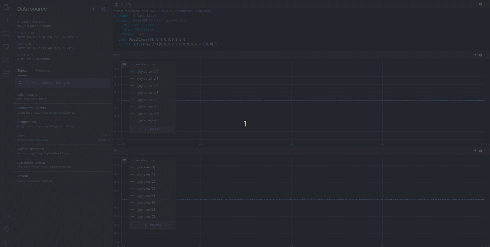

# BloX LIS3DH

The BloX Joy Linux implements [ROS2 drivers for a generic Linux joystick](https://github.com/ros-drivers/joystick_drivers).

## Data

The BloX Joy Linux publishes joystick data as [sensor_msgs/msg/Joy](http://docs.ros.org/en/api/sensor_msgs/html/msg/Joy.html)

## Visualization

